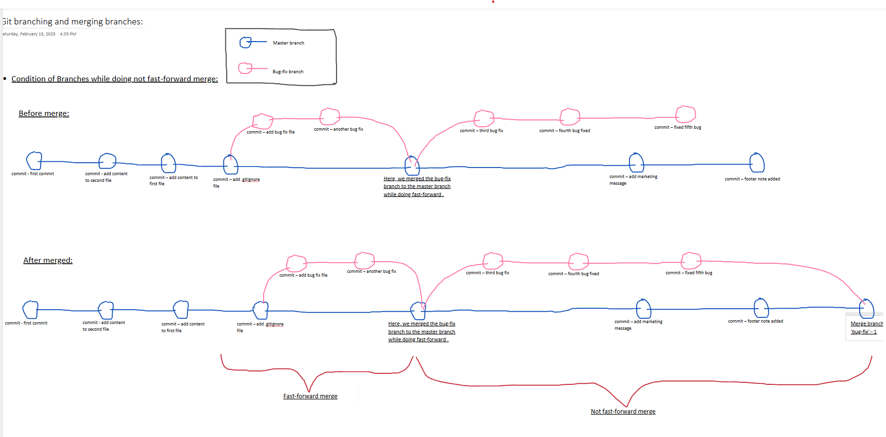

# Branches in git

- Branches are a way to work on different versions of a project at the same time. 

- They allow you to create a separate line of development that can be worked on independently of the main branch. 

> This can be useful when you want to make changes to a project without affecting the main branch or when you want to work on a new feature or bug fix.

> For pictorial example, do visit: [Chai aur Git](https://docs.chaicode.com)

---

- Some developers can work on Header, some can work on Footer, some can work on Content, and some can work on Layout. This is a good example of how branches can be used in git.

---

## HEAD in git

- The    HEAD     is a pointer to the current branch that you are working on. It points to the latest commit in the current branch. When you create a new branch, it is automatically set as the HEAD of that branch.
  
> The default branch used to be master(YOU can go to "temp_folder1/.git/HEAD" and check it out, What the head is pointing. NOT Officially checked by this way. Officially checked by: `git branch` command), but it is now called main. There is nothing special about main, it is just a convention.

## Creating a new branch

- To create a new branch, you can use the following command:

* `git branch` 
> This command lists all the branches in the current repository.

* `git branch bug-fix` 
> - This command creates a new branch of given name (HERE, given name of branch is bug-fix).
>
>  (After this command, you can check it out to: 
>  "temp_folder1/.git/refs/heads"), NOT officially checked by this way. Officially checked by: `git branch`  command

* `git switch bug-fix` 
> This command switches to the given branch name (HERE, given branch name is bug-fix).

> Tip: Commit before switching to a branch, if you have to do.

* `git log` 
> This command shows the commit history for the current branch.

* `git switch master` 
> This command switches to the master branch.

---
> Note: After switched from another branch to master branch,                                                
> right now you not gonna see:                                       
1) [ the commits of that previous branch in the master branch, if you do: `git log`    OR,   `git log --oneline` command.]                                  AND                                                      
2) [ files in your repository of that previous branch in the master branch (since, we had created a temp_bug_fixes.txt file that not gonna be visible, while in master branch) ]. 

### Q. Hmm... Why, we are not able to see the commits and files of that previous branch in the master branch ?
>Ans:
> Since, they are branches which makes the alternative line for them and donot interperate the main(master) branch.
> i.e. The previous branch (we used previous branch as: bug-fix) makes separete line for itself.
>
> And that's why we are unable to see the commits and files of that previous branch to master branch.

- PICTORICALLY, how the branched happen till now while working with previous branch(we used: bug-fix) and main(master) branch :
---

<pre>    (bug-fix) 
            |-----*         
            |           
            |            
*---*---*---*-----
(master)                </pre>

---

* `git switch -c dark-mode` 
> - This command creates a new branch of given name (HERE, given branch name is dark-mode). the -c flag is used to create a new branch.
> - (This command creates directly a new branch and then switches itself to that a new branch.)

* `git checkout orange-mode`      
> This command checkouts the given branch (HERE, given branch is orange-mode), if exists then, switches to the orange-mode branch. OTHERWISE, displays:
  
> error: pathspec 'orange-mode' did not match any file(s) known to git

> - This `git checkout <branch-name>` is mostly used to switch and checkout
> RATHER then, 
> `git switch -c <branch-name>`

## Merging branches

- Let's move on to merging branches, 

### Q. Hmm... merging, why it is needed ?
>Ans:
> In Git, merging is needed to combine changes from different branches into a single branch. This is crucial for collaborative development and maintaining a consistent codebase. Here are the main reasons:

1) Collaboration
:
 When multiple developers work on different features or bug fixes in separate branches, merging brings all those changes together.

2) Feature Integration
:
 New features are usually developed in isolated branches. Merging integrates the completed feature into the main branch (e.g., main or master).

3) Conflict Resolution
:
 Merging helps identify and resolve conflicts that arise when changes made in one branch overlap with changes in another.

4) History Preservation
:
 A merge keeps the commit history of both branches, showing how the code evolved over time.

5) Maintenance and Updates
:
 If a branch lags behind the main branch, merging the latest updates keeps it up to date.
---

## 1) Fast-forward merge

- This one is easy as branch that you are trying to merge is usually ahead and there are no conflicts.

> When you are done working on a branch, you can merge it back into the main branch(Make SURE you are on the master/main branch while merging another branch to master/main branch). 
- This is done using the following command:

* `git checkout master` 
> This command switches to the master branch since, we wanted to merge the another branch(we used another branch as: 'bug-fix' branch) to main(master) branch. So, do it 1st this if you haven't.

* `git merge bug-fix` 
> This command merges the another branch (HERE, another branch is: bug-fix branch) into the main branch.
---
In this point of time, while I was learning. I did make note with picture in Microsoft OneNote.

---

- This is a fast-forward merge. It means that the commits in the bug-fix branch are directly merged into the main branch. This can be useful when you want to merge a branch that has already been pushed to the remote repository.

## 2) 3 way merge

- In this type of merge, the master branch also worked and have some commits that are not in the bug-fix branch. This is called 3 way merge.

- When you are done working on a branch, you can merge it back into the main(master) branch. This is done using the following command:

* `git checkout master`
> This command switches to the master branch since, we wanted to merge the another branch(we used another branch as: 'bug-fix' branch) to main(master) branch. So, do it 1st this if you haven't.

* `git merge bug-fix`

---
> In this point of time, while I was learning I did make note with picture in Microsoft OneNote. You can visit it in: "Git Branching"  or  You can visit screenshot: "4)_Merging_not_fastForward.png".  

---

## Conflicts

### Q. If the command are same, what is the difference between fast-forward and not fast-forward merge?
> Ans:
> - The difference is resolving the conflicts. 
>
> - In a fast-forward merge, there are no conflicts. 
> - But in a 3 way merge, there can occur conflicts, and there are no shortcuts to resolve them. You have to manually resolve the conflicts. Decide, what to keep and what to discard. VSCode has a built-in merge tool that can help you resolve the conflicts.

> For pictorial example, do visit: [Chai aur Git](https://docs.chaicode.com)

### Q. Conflicts! , Hmm... what is that and how it does occur?
> Ans:
>
> - A conflict is a situation in which unacceptable differences in interests, expectations, values, and opinions occur in or between individuals or groups.
> 
> - Conflicts doesnot occurs themself. Conflicts occurs when the same file is modified in two or more than two branches by different statements and then you try to merge those branches, then you will see the occurence of conflict. 

## Managing conflicts

- There is no magic button to resolve conflicts. You have to manually resolve the conflicts. Decide, what to keep and what to discard. VSCode has a built-in merge tool that can help you resolve the conflicts. I personally use VSCode merge tool. Github also has a merge tool that can help you resolve the conflicts but most of the time I handle them in VSCode and it gives me all the options to resolve the conflicts.

Overall it sounds scary to beginners but it is not, it’s all about communication and understanding the code situation with your team members.

> After conflict resolved, then just do:
- add and commit ,(not needed to merge again)
and done.

## Rename a branch

- You can rename a branch using the following command:
* git branch -m <old-branch-name> <new-branch-name>

## Delete a branch
You can delete a branch using the following command:
* git branch -d <branch-name>

